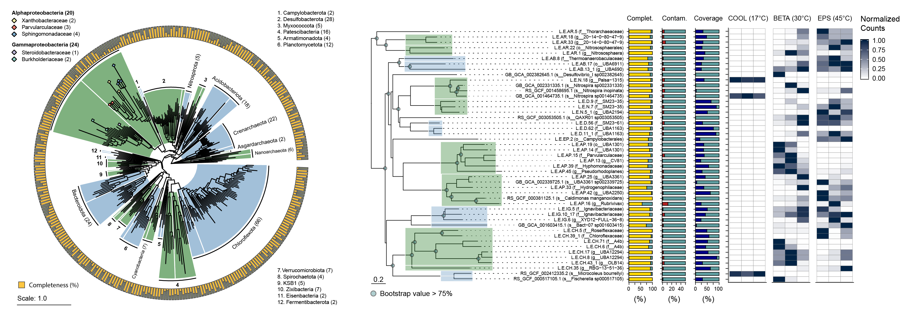
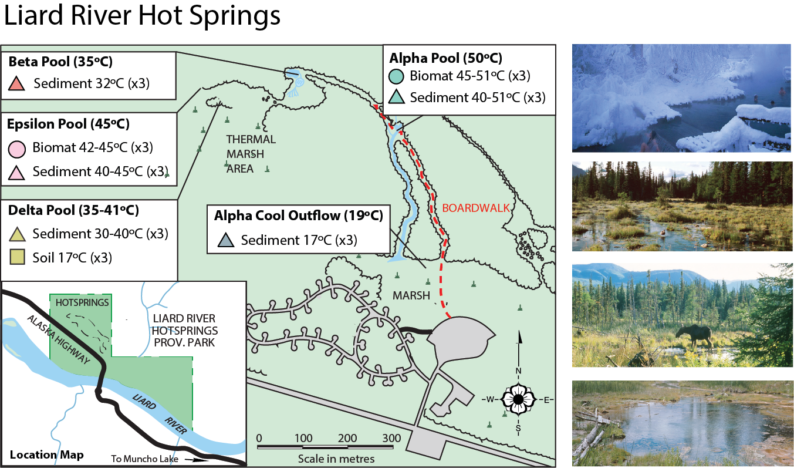
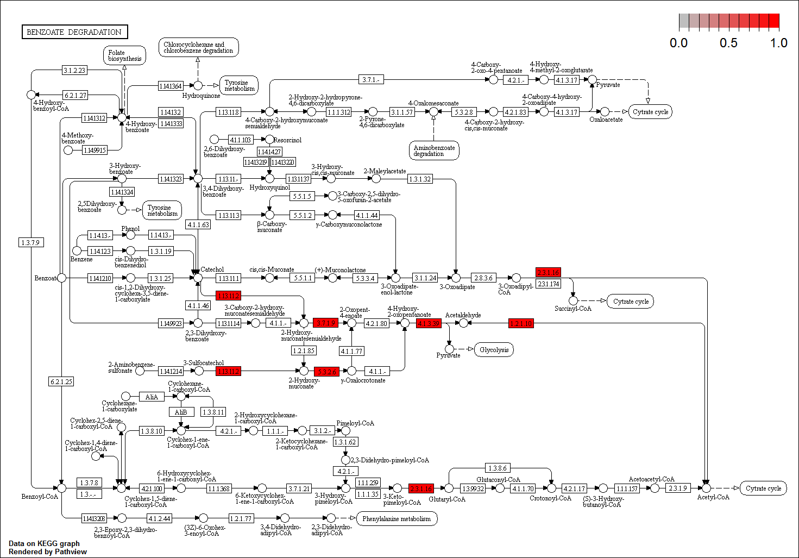

```{r setup, include=FALSE}
knitr::opts_chunk$set(echo = TRUE)
```

## Overview

Metagenomics and metatranscriptomics offer unparalleled insight into the taxonomic and functional diversity present across a multitude of environments. Yet the vast amounts of data these tools produce is challenging to effectively analyze and visualize.

We will analyze a unique thermal swamp metagenome and metatranscriptome dataset to develop strategies for effective visual communication.



This workshop is designed around the application of whole-genome phylogenetic analysis to organize the diverse data types that we can generate from metagenomics and metatranscriptomics analysis. 

You will learn: 

1. Manipulating and visualizing whole-genome phylogenies with <i>ggtree</i> 
2. Mapping genome assembly statistics to phylogenetic trees with <i>ggplot2</i>
3. Processing count data from <i>Meiji</i> and mapping to phylogenetic trees
4. Genomic functional annotation and pathway analysis with <i>pathview</i>
5. Mapping metatranscriptomic count data and coverage to circular genome maps with <i>circlize</i>

This workshop assumes some prior experience with R (such as that in our [Introduction to R workshop](https://github.com/EDUCE-UBC/workshops_R/tree/master/intro_R_2hr)). All code presented in this workshop is contained in the "metagenomics.R" R script file. 

You can follow along with the workshop by selecting the relevant line(s) of code and pressing ctrl+enter on Windows, cmd+enter on MacOS, or using the "Run" button in the upper right of your script window to execute it.

Note that the majority of this workshop uses base R functions. No experience with Tidyverse is required. 

Please call over the instructor or a TA if you have any problems with executing the code or if you need any help with the exercises. 

# Prior to the workshop

## Setup Instructions

Please come to the workshop with your laptop setup with the required software and data files as described in our setup instructions.

## Making an RStudio Project

Projects allow you to divide your work into self-contained contexts.

Let's create a project to work in.

In the top-right corner of your RStudio window, click the "Project: (None)" button to show the projects
drop-down menu. Select "New Project." > "New Directory" > "New Project." Under directory name, input
"metagenomics" and choose a parent directory to contain this project on your computer.


## Installing Packages

Many R packages can be downloaded and installed from The Comprehensive R Archive Network (CRAN).


You can install each package with the following code: 

```{r eval = FALSE}
install.packages("BiocManager",
                   "devtools",
                   "RColorBrewer",
                   "ape", 
                   "tidyverse",
                   "ggplot2",
                   "phytools",
                   "stringr", 
                   "reshape2",
                   "cowplot",
                   "grid",
                   "circlize",
                   "dplyr", 
                   "aplot")

```

To make things a bit more difficult, there are other source of R packages, such as Bioconductor, which provides tools for the analysis and comprehension of high-throughput genomic data.

```{r eval = FALSE}
BiocManager::install("pathview")
```

##Install ggtree

And finally, we have to install the developmental version of _ggtree_ from GitHub [https://github.com/YuLab-SMU/ggtree](https://github.com/YuLab-SMU/ggtree). **This is very important to ensure colored ranges are applied correctly** (the Bioconductor version does not apply colors to trees correctly)

```{r eval = FALSE}
library(devtools)
install_github("YuLab-SMU/ggtree")
```

##Loading Packages 

Next, we should check if all packages can be loaded properly. If a package does not load because of a missing package, please install the package (as shown above) and try again.  

```{r, message=FALSE, warning=FALSE}
# Suite of packages for data manipulation and visualization
library(tidyverse)
# Working with trees
library(ape)
library(phytools)
# Plotting Grammar of Graphics
library(ggplot2)
# Tree visualization
library(ggtree)
# String manipulation
library(stringr)
# Data structure manipulation
library(reshape2)
# Multi-panel figure layouts
library(cowplot)
library(grid)
# Color maniputation
library(RColorBrewer)
# Pathway analysis with KEGG Orthologs
library(pathview)
#plot circular graphs and contig maps
library(circlize)
```

##Downloading Workshop Material

The material for this workshop is hosted on GitHub [https://github.com/davidlevybooth/Metagenomics_Workshop](https://github.com/davidlevybooth/Metagenomics_Workshop).

Follow the above link and click the green "Clone or download"" button to download all files as a .zip archive. Unzip the archive to access files. 

# Loading custom functions

I have written some helpful functions to replace some time-consuming workflows. Please load them from the source R script like this: 

```{r}
#Custom functions for metagenomics and metatranscriptomics
source("scripts/metagenome.utilities.R")
```

Please ensure all packages are installed and up to date, and that you have all data downloaded prior to the start of the workshop. If you require any assistance, please contact David Levy-Booth (dlevyboo@mail.ubc.ca). 

We will also spend a few minutes prior to the workshop ensuring that all attendees have completed setup and installation.

# Sanity Check

Because _ggtree_ is the main package that we will work with throughout the workshop, please ensure that you can reproduce a simple example plot using this package. 

Please enter the following code in RStudio and ensure your output matches the plot provided:

```{r message=FALSE, warning=FALSE, fig.height = 5, fig.align = "center"}
library(ape) #in case you did not load the package earlier. 
library(ggtree)

set.seed(2020)
example.tree <- rtree(4)
ggtree(example.tree) + geom_balance(node=6)
```

If your plot **does not** look like this, you may have to re-install the _ggtree_ package from GitHub and any dependent packages. If it does, congratulations, we are ready to begin!

## Background: Field site and shotgun sequencing methods



Thermal swamp complexes are rare ecosystems containing unknown diversity of biogeochemical cycling and organic biomass-recycling microbial consortia. By applying metagenomic and metatranscriptomic techniques across thermally-distinct environments we can better understand the organisms responsible for nutrient transformations in these ecosystems, and how their distributions are shaped by thermal properties. Characterizing the thermal microbiome can also open up new biotechnological possibilities including lignin bio-refinement. 

Liard River Hot Springs [(59.431, 126.1)](https://goo.gl/maps/hYndRPAKR9hLu8jo9) is a complex of carbonate-hosted hot springs that feed thermally-warmed meteoric waters to extensive swampland underlayed by sandstone and shale. The pools are surrounded by unique thermal meadow vegetation and mixed forest (_Populus tremuloides, Betula papyrifera, Picea glauca_). The two main hot spring samples we will analyze in this workshop are Beta (30-35^o^C) and Epsilon (40-45^o^C) pools. Water cools as it traverses the marshland via the Alpha river outflow to about 17^o^C at our final sampling location (Cool).

One ng DNA from three replicates of selected sediment samples (Cool, Beta, Epsilon) was prepared for shotgun sequencing on one NextSeq550 (Illumina) run in High Output mode using Nextera XT library preparation (Illumina). 

As the warmest undisturbed pool, 2 g sediment from Epsilon was incubated with 10 mg of vanillate, Eucalyptus milled-wood lignin (EMWL), Eucalyptus Kraft lignin (EKL), Coniferyl-alcohol dehydrogenase-polymer (DHP). Control incubations were conducted with no exogenous carbon. RNA was extracted from approx. 0.5 g sediment. RNA integrity was measured using an Agilent 2100 Bioanalyzer (Agilent Technologies) before and after rRNA removal with RiboMinus Transcriptome Isolation Kit, bacteria (ThermoFisher). Sequencing libraries were prepared using SuperScript Double-Stranded cDNA synthesis (ThermoFisher) and NexteraXT (Illumina) for sequencing using NextSeq550 (Illumina) High Output.

Genomes were extracted from metagenome assemblies using [MetaBat2](https://github.com/Ecogenomics/GTDBTk) and manually refined. 

## Background: Genome Taxonomy Database

The Genome Taxonomy Database (GTDB) [https://gtdb.ecogenomic.org/](https://gtdb.ecogenomic.org/) is a standardized bacterial and archaeal taxonomy based on genome phylogeny. It contains about 24,000 species-level genomes with revised taxonomy for the genomic era. We will leverage the GTDB and its associated classification tool, GTDB-Tk [https://github.com/Ecogenomics/GTDBTk](https://github.com/Ecogenomics/GTDBTk) to classify and place the whole-genome phylogeny of our assembled genomes. 

For each genome our job will be to answer the following biological questions:

1. What are they? (Taxonomic classification) 
2. Can we trust them? (Assembly statistics)
3. Where are they? (Abundance calculations)
4. What can they do? (Function/Pathway analysis)
5. What are they doing? (Metatranscriptomics)

## Introduction to phylogenomics

Please see the slide deck for an introduction to, and motivations for, phylogenetic analysis of microbial genomes.

Note that due to time and memory constraints, the genomes that we will use in this workshop have already undergone classification with GTDB-Tk. 

# Section 1. Basic Tree Plotting

Load the GTDB-Tk tree for Thermal Swamp Metagenome-Assembled Genomes (MAGs). 

We use the analyses of phylogenetics and evolution (ape) package, which provides basic functionality for loading and manipulating phylogenetic data. Here, we will use the read.tree() function to open the GTDB-Tk classification tree for the genomes that we will use in throughout these exercises. 

Note that GTDB-Tk will separately analyze and place archaeal and bacterial genomes using 122 or 120 single copy genes (SCGs). We then used the bind.tree() function to combine both trees at their default roots. This combined tree is what is provided for you. 

```{r}
tree.path <- "data/gtdb.classification.tree"

#Use read.tree(<tree.path>) to load tree file from path.  
#Important: Make sure you use the "ape" version of the read.tree() function
tree <- ape::read.tree(tree.path)


#Inspect tree object
tree
```

Let's also load the taxonomy paths for the GTDB Genomes. The taxonomy of the GTDB is based on a revised, standardized taxonomic-rank normalization according to relative evolutionary divergence (RED). [(See Park et al., 2018. Nat. Biotech 4229)](https://www.nature.com/articles/nbt.4229)

```{r}
GTDB.taxonomy.path <- "data/gtdb.taxonomy.tsv"

#Load data
GTDB.taxonomy <- read.csv(GTDB.taxonomy.path, sep="\t", stringsAsFactors = FALSE)

```


What does the taxonomy data look like? 


```{r}
head(GTDB.taxonomy)
```

Isolate tip labels. Each tip is a genomic placement. 


```{r}
tips <- tree$tip.label
head(tips)
```

> Question: What other data are associated with tree objects? How can you access it? (tip: look at help page of function ape::read.tree, type "names(tree)"", or "tree"" followed by the dollar sign to see what is autofilled: tree$)

If we try to plot all 23K GTDB bacterial genomes with MAG placements the figure would be a mess, and my computer will probably explode. Let's subset the number of tips to a reasonable number first using a custom function. 

```{r}
#Let's set "seed" to ensure that we all end up with the same list of tips to keep
set.seed(69420)
tips.keep <- sample_gtdb_tips(tips, 1000)
```

Use keep.tips() to subset tree.

```{r}
tree.subset <- keep.tip(tree, tips.keep)


#if you are having difficulty with you subset tree, please uncomment to load from the following file:
#tree.subset <- read.tree("results/tree.subset")
```

> Question: How else could we have accomplished this? (tip: look at ape::drop.tip function)


Plot the reduced tree with ggtree. 

Note that we set xlim() to make room for longer labels (ggtree generally does a poor job of managing plot space)

```{r fig.height = 3, fig.align = "center"}
tree.plot <- ggtree(tree.subset) + xlim(0,4)
tree.plot
```

We can take advantage of several layouts. 

For example, while we will focus on plotting data to linear trees, let's take a look at plotting a circular tree, just for kicks. 

```{r fig.height = 3, fig.align = "center"}
ggtree(tree.subset, layout="circular")
```

Plot the reduced tree with ggtree -- add tip labels with geom_tiplab()

```{r fig.height = 3, fig.align = "center"}
tree.plot + geom_tiplab(size = 2)
```

Hmm, not very readable. Let's add phyla labels with geom_cladelabel() instead.

First, let's use the taxonomy table to select a random phyla from the GTDB. I'm using Firmicutes_A, but we could select any number of other targets. 
Note that we are trying to isolate one specific group of genomes by GenomeID that all share the same Phylum. To do this we subset the GTDB taxonomy table using the which() function, _which_ creates a Boolean vector of rows that match our condition: in this case if the Phylum column contains the string "p__Firmicutes_A"

Let's review some base R fundamentals before we proceed: 

A data.frame in R is made of rows of observations and columns of variables. For metagenome or microbiome count data, rows are typically genome, OTUs, etc., which columns containing counts in each sample. Note that this organization is transposed for some ecological statistics packages (e.g., in _vegan_) that expect rows of samples with columns of species/OTUs/genomes. 

Regardless, the rows and columns within a data.frame is represented by positions between square brackets, e.g., [rows, columns]. So if we want to take the first 4 rows we can subset the data.frame like this: 

```{r eval=FALSE}
data.frame[1:4, ] 
# This is an example, don't actually try to run this"
```

This means that we can use index (index) vectors OR Boolean (True, False) vectors to subset data with a host of functions (which, match, etc.). Below we use which to subset the data.frame, which has analogous functionality to filter() in tidyverse. 

To demonstrate this we will subset the GTDB taxonomy table to only our clade of interest. We then only take the GenomeIDs for these subset genomes. We must also ensure that the resulting list is a character vector because a factor will do screwy things to the findMRCA() function. 

```{r}

#Assign our phylogenetic clade of interest to a variable called "Clade"
Clade <- "p__Firmicutes_A"


#Here we combine a few base R functions to subset the GTDB taxonomy table to only: 
GTDB.taxonomy.clade <- GTDB.taxonomy[which(GTDB.taxonomy[,"Phylum"] == Clade),]
Firmicutes_A_tips <- GTDB.taxonomy.clade$GenomeID

head(Firmicutes_A_tips)
```

> Question: Can you obtain the same using the tidyverse (tip= use subset)

```{r}
Firmicutes_A_tips_tidyverse = GTDB.taxonomy %>%
    subset(Phylum==Clade) %>%
    pull(GenomeID) %>%
    as.character()
head(Firmicutes_A_tips_tidyverse)
```

Let's find the most recent common ancestor (MRCA) node for the Firmicute_A phylum. 

To find the MRCA, we have to learn to use the findMRCA() function in the phytools package. This allows us to find the common ancestor nodes for a list of tree tips. 

```{r}
Firmicutes_A_node <- findMRCA(tree, Firmicutes_A_tips, type="node")
Firmicutes_A_node
```

Next, I created the collapse_nodes() helper function (in metagenome.utilities.R) to apply findMRCA() over the whole tree to collect nodes for all phyla. It works by iterating through each clade at a specified taxonomic level (in this case "Phylum"), and calculates the ancestor node, how many tips belong to each clade, and the maximum branch length of the clade (useful for plotting collapsed clades). 

```{r echo = TRUE, results='hide'}
Phyla.nodes <- collapse_nodes("Phylum", tree.subset, GTDB.taxonomy)
```

Almost done, next we can highlight clades of interest. 

We use the which() function again as above. 

> Question: How would we filter the table using tidyverse notation? 

```{r fig.height = 3, fig.align = "center"}

#In tidyverse
Phyla.nodes %>% 
  filter(Group == "p__Firmicutes_A") %>% 
  .$Node

#In base R
Firmicutes_A_node <- Phyla.nodes[which(Phyla.nodes$Group == "p__Firmicutes_A"), ]$Node

Firmicutes_A_node


tree.plot <- ggtree(tree.subset) + xlim(0,4)

tree.plot + geom_balance(node=Firmicutes_A_node, 
                         fill='darkgreen', 
                         color='white', 
                         alpha=0.6, 
                         extend=1)  +
             geom_cladelabel(node = Firmicutes_A_node, 
                             "Firmicutes A", 
                             offset = 1, 
                             fontsize = 2)
```

> ADVANCED: Plot highlights for other clades. How do you highlight more than one clade? (hint: add additional geom\_balance() and geom\_cladelabel() functions)

What about for ALL major clades?

We can run geom_balance() to produce colored ranges for all phyla in our dataframe in a "FOR" loop. 

```{r fig.height = 5, fig.align = "center"}
colors <- some_color(Phyla.nodes)

#For loops are a basic tool used in scripting languages. 

for(i in 1:nrow(Phyla.nodes)) {
  if(Phyla.nodes$TipCount[i] > 10) {
  tree.plot <- tree.plot + 
    geom_balance(node=Phyla.nodes$Node[i], fill=colors[i], color='white', alpha=0.6, extend=0.6)  +
    geom_cladelabel(node = Phyla.nodes$Node[i], Phyla.nodes$Group[i], offset = 0.6, fontsize = 2)
  }
}
tree.plot
```


Can we do this for a circular plot?

To assist with adding colored ranges to the tree you are provided with a new custom function called clade_colors() that simply runs the loop above. It can be used with rectangular or circular trees. 

```{r fig.height = 3, fig.align = "center"}
tree.plot <- ggtree(tree.subset, layout="circular")
tree.plot <- clade_colors(tree.plot, Phyla.nodes, colors)
tree.plot
```

(Looks pretty badass to me!) 

One more thing: adding bootstrap values to trees

```{r}
tree.subset$node.label <- parse_bootstraps(tree.subset, method = "parse")
```

ggtree is sometimes counterintuitive. Case in point geom\_nodepoint() counts tips as nodes. To make sure we have enough elements in our final list of bootstraps, we have to build a vector of bootstrap values that also includes the number of tips. We can do this with another helper function called "parse\_bootstraps()."

```{r}
bs_count <- parse_bootstraps(tree.subset, method = "count")
tail(bs_count)
```

Plot numeric bootstrap values with the ggtree::geom_text() implementation: 

```{r  fig.height = 3, fig.align = "center"}
ggtree(tree.subset) + xlim(0,3) + geom_text(aes(label = bs_count), size = 2)
```

Simple graphical representation of Bootstrap values 

```{r fig.height = 3, fig.align = "center"}
tree.plot <- ggtree(tree.subset) + 
                xlim(0,4) + 
                geom_nodepoint(aes(subset= bs_count >= 90), 
                               fill = "cadetblue",
                               size=1.5, 
                               alpha = 0.5, 
                               shape = 21)

tree.plot
```

And add phyla labels:

```{r fig.height = 3, fig.align = "center"}
tree.plot <- clade_labels(tree.plot, Phyla.nodes, tiplimit = 5, fontsize = 2)
tree.plot
```

Finally, we must add a scale representing the substitution distance

```{r  fig.height = 5, fig.align = "center"}
tree.plot + geom_treescale(x=0, y=length(tree.subset$tip.label)-50, width=0.2, offset = 10)
```

> Exercise: Using the above functions, find and highlight the phylum of your genome in a tree with bootstrap values and a scale


# Section 2. Plotting MAG phylogenies

Set path for MAG taxonomy table and import. 

Note that we use the read.csv() function here, but set the delimiter to tabs.

> Question: What are the differences between read.csv(), read.table() and read.delim()?

```{r}
mag.taxonomy.path <- "data/gtdb.classification.tsv"
mag.taxonomy <- read.csv(mag.taxonomy.path, sep="\t")
```

Subset tree to show only MAG placements using keep.tips().

```{r}
tree.mags <- keep.tip(tree, as.character(mag.taxonomy$GenomeID))
tree.mags
```

Plot MAG tree with ggtree()

```{r fig.height = 3, fig.align = "center"}
tree.plot <- ggtree(tree.mags, ladderize=F) + geom_tiplab(size = 2) + xlim(0,2.6)
tree.plot
```

> Question: Why is 'ladderize=F' so important here? Hint: it has to do with the order of the genomes vertically.  

Add arbitrary color ranges with the predefined some_color() function. 

> Advanced: Check out the some_color() function in the metagenome.utilities.R file. how would you change this function to change how colored ranges are applied to taxonomic clades? 

```{r echo = TRUE, results='hide'}
Phyla.nodes <- collapse_nodes("Phylum", tree.mags, mag.taxonomy)
colors <- some_color(Phyla.nodes)
```

Create tree plot with custom clade colors: 

```{r}
tree.plot <- clade_colors(tree.plot, Phyla.nodes, colors, extend = 0.6)
tree.plot
```

Add bootstraps with the parse_bootstraps() function: 

```{r}
tree.mags$node.label <- parse_bootstraps(tree.mags, method = "parse")
bs_count <- parse_bootstraps(tree.mags,method = "count")
```

> Question: What's the deal with the raw node values in the GTDB tree? How do we even find this information? (hint look at tree.mags$node.label before running parse_bootstraps())  

Finally: Add it all together for a great looking phylogeny of our MAGs:

```{r fig.height = 5, fig.align = "center"}
tree.plot <- tree.plot + 
  geom_nodepoint(aes(subset= bs_count >= 75), fill = "cadetblue", size=2, alpha = 0.5, shape = 21) + 
  geom_treescale(x=0, y=1, width=0.1, offset = 0.5)

tree.plot
```

> ADVANCED: How would you go about highlighting only your genome tip of interest? (hint: remember how we used geom_balance() in the first exercise?)

# Section 3. MAG statstic plots

We can use checkM data to map genome binning metrics to MAG tree. CheckM uses single copy genes (SCGs) to determine the levels of completeness and contamination ("redundancy") in a genome bin. We also use BBMap to calculate coverage. 

```{r}
MAG.checkM.path <- "data/checkm.qa.tsv"
MAG.checkM <- read.csv(MAG.checkM.path, sep="\t")

head(MAG.checkM)
```

To plot data we must organize data in the 'long' format using reshape2::melt()

> Question: What is the difference between 'wide' and 'long' data formats? When would each be used? 


```{r}
MAG.checkM.long <- melt(MAG.checkM, id.vars = "GenomeID")
```

"Wide" data:
```{r}
head(MAG.checkM)
```

"Long" data:
```{r}
head(MAG.checkM.long)
```

Remember to set GenomeID as an ordered factor to match tree tip order. Factors are important in R for organizing data without changing the order of the underlaying data. 

```{r}
MAG.checkM.long$GenomeID <- factor(MAG.checkM.long$GenomeID, 
                                   levels = tree.mags$tip.label)

MAG.checkM.long$variable <- factor(MAG.checkM.long$variable, 
                                   levels = rev(unique(MAG.checkM.long$variable)))
```

Create separate 'completeness' data.frame (still in "long" format). 

We will use the imported 'factorize()' function to set a variable to be a factor where the factor levels are simply the current order of the variable in the data.frame. 

But first we get to learn a new function! 

> Question: What is grepl()? How does it differ from grep()?

> Answer: GREP stands for Global Regular Expression Print. We can match strings (characters), including with a wide variety of "wildcards" to subset a data.frame() by creating a numeric index vector for matching entries. 

> grepl(), (grep logical) in contrast, produces a Boolean vector. This is really useful for certain functions like ifelse() that apply different outcomes based on Booleans. 

Here, we could use grep() or grepl() to catch rows containing both the "Completeness" variable as well as the completeness residual "Completeness_AR" variable. 

```{r}
#Subset to get only the completness data
MAG.checkM.long.completeness <- MAG.checkM.long[grepl("Completeness", MAG.checkM.long$variable), ]

#R gets some kooky ideas how we should order our data.
#Here we explicitly tell R to keep the order of your genomes (variables)
#using the factorize() helper function.
MAG.checkM.long.completeness$variable <- factorize(MAG.checkM.long.completeness$variable, rev = TRUE)
```

> Question: Why do you think we used rev = TRUE here? 

> Answer: When we plot data in ggplot2 with flipped x and y axes using coord_flip(), the order of the "y-axis" can be reversed from what we expect. The factorize() function is designed to account for this. 

This is how we would create the completeness plot with ggplot2. 

Within ggplot function we first specify the data.frame that contains the data. 

We then set the plotting aesthetics with aes() -- including the "x" and "y" variables. Here we also indicate that factors will be differentiated using "fill". 

> Question: How does "fill" differ from "color"? 

We could just plot the bin completeness with a single bar, but I would like to have more control over the aesthetics of the unplotted region. To do this we have calculated the "residual" (100-completeness) and can assign a different fill color for this region manually. The residuals are plotted with completeness values as a stacked bar plot.  

```{r eval=FALSE}
ggplot(MAG.checkM.long.completeness,
       aes(x = GenomeID, y = value, fill = variable)) +
  geom_bar(stat = "identity", color = "black") + #The "black" color provides the border. 
  scale_fill_manual(values = c("cadetblue", "gold")) + #Manually assign fill for residual and completeness
  coord_flip() + #Switches the x and y axis to produce vertical stacked bar plot. 
  theme(legend.position = "none") + #We don't need a legend for these data
  ylab("Completeness") #Add label
```

That will work, but it would be cool to create a function that lets us apply extra formatting to all similar plot types. tree_bar_plot() replicates and extends the above ggplot plotting instructions. All we need to supply is the data and the x-axis label.  

```{r fig.height = 3, fig.align = "center"}
MAG.completeness <- tree_bar_plot(MAG.checkM.long.completeness, "Completeness")
MAG.completeness
```

> Question: Why did we not include y-axis text? How can we change the above plot to double check that we got the y-axis order correct?

> ADVANCED: Create similar plots for genome Contamination and Coverage

```{r}
MAG.checkM.long.contamination <- MAG.checkM.long[grepl("Contamination", MAG.checkM.long$variable), ]
MAG.checkM.long.contamination$variable <- factorize(MAG.checkM.long.contamination$variable, rev = TRUE)

MAG.checkM.long.coverage <- MAG.checkM.long[grepl("Coverage", MAG.checkM.long$variable), ]
MAG.checkM.long.coverage$variable <- factorize(MAG.checkM.long.coverage$variable, rev = TRUE)


MAG.contamination <- tree_bar_plot(MAG.checkM.long.contamination, "Contamination", 
                                   colors = c("cadetblue", "firebrick"))

MAG.coverage <- tree_bar_plot(MAG.checkM.long.coverage, "Coverage", 
                              colors = c("cadetblue", "darkblue"))
```

> Question: Is there an even more efficient way to create multiple plots using ggplot2? 

Put it all together to plot genome statistics with the tree we created earlier: 

```{r}
tree.plot <- tree.plot + scale_y_tree() #got a warning here '`expand_scale()` is deprecated; use `expansion()` instead. '
```

> Question: Wait, why do we need this scale_y_tree() function?

> Answer: scale_y_tree() is critical for aligning ggtree plots with ggplots.

> Change values in scale_y_tree() function in data/metagenome.utilities.R if you need to change the vertical alignment with a ggplot. Warning: setting the y-scale is only for advanced users. 

Align all plots together with cowplot::plot_grid()

> Notice that we should be able to horizontally align the plots at the bottom axis with align = "h" and axis = "b" 

```{r fig.height = 5, fig.align = "center"}
MAG.title <- plot_title("Liard River Phylogeny and Statistics")

MAG.plots <- plot_grid(tree.plot, 
                       MAG.completeness, 
                       MAG.contamination, 
                       MAG.coverage, 
                       align = "h", 
                       axis = "b", 
                       ncol = 4, 
                       rel_widths = c(1.25, 0.25, 0.25, 0.25))

#Nesting the plot_grid() function allows us to easily add titles to our groups of plots!
plot_grid(MAG.title, 
          MAG.plots, 
          ncol = 1, 
          rel_heights = c(0.1, 1))
```

Looks great!


# Section 4. Aligning abundance plots with phylogenetic trees.

Now we will use a heatmap to explore MAG environmental abundance and temperature range.

Load count data. Meiji was used to align shotgun metagenome reads to MAGs and select GTDB genomes. 

```{r}
counts.path <- "data/metagenome.counts.tsv"
counts <- read.table(counts.path, sep="\t", header = TRUE)
```

We should also parse the lowest level of taxonomic classification so we can tell what the heck each genome is without having to plot the whole taxonomy string. 

```{r}
#tax_class() is helper function from metagenome.utilities.R
counts$Classification <- tax_class(counts$Taxonomy)
```

Optionally, we can calculate relative abundance for each sample:

```{r}
#relative_abundance() is helper function from metagenome.utilities.R
counts.ra <- relative_abundance(counts)
```

Or normalize across taxa:

```{r}
#normalize() is helper function from metagenome.utilities.R
counts.norm <- normalize(counts)
```

Now, match the count data to the order of the tree (remember why we set 'ladderize=F'?), then format for plotting.

We use the match() function a few more times to ensure these data are organized correctly. 

* _%in%_ subsets a data.frame by creating Boolean vector of presence or absence in a list. 
* _match_ creates an index vector to re-order data.frame rows using a character vector.
* _order()_ re-orders data.frame rows based on alphanumeric variables. 
* _factor()_ re-orders hierarchy of data.frame row entries without changing the data itself

> _match_ is a really useful function for keeping data organized across data.frames! 


> Question: Can you tell what the tax_class() function is doing by looking at the function in the "metagenome.utilities.R" script? 

```{r}
#We once again match the counts.norm and mags.taxonomy.norm data.frames with the order of tips in the tree.
#It can be confusing that the first vector in the match function is actually
#what you're trying to match to, so be careful with the order. 

counts.norm <- counts.norm[match(tree.mags$tip.label, counts.norm$GenomeID), ]
mag.taxonomy.norm <- mag.taxonomy[match(tree.mags$tip.label, mag.taxonomy$GenomeID), ]

#Now that the tree tip, counts.norm and mag.taxonomy.norm all match we can consolidat the variables we want to retain in the counts.norm data.frame. 
counts.norm$GenomeID <- tree.mags$tip.label
counts.norm$Taxonomy <- mag.taxonomy.norm$Taxonomy

#Finally we use the tax_class() function to pull out the lowest level of GTDB classification for each genome in the counts.norm data.frame. 
counts.norm$Classification <- tax_class(counts.norm$Taxonomy)
```

Melt data.frame for plotting and do some more formatting:

```{r}
#Transform the count data to the "long" format for plotting. 
#reshape2::melt() creates three types of columns: IDs, variables and values. 

#We want to retain "GenomeID", "Taxonomy", and "Classification" as IDs. 
#And we keep the actual counts as the "value". Making each sample a "variable"
counts.long <- melt(counts.norm, 
                    id.vars = c("GenomeID", "Taxonomy", "Classification"), 
                    value.name = "norm.count")

#Use factorize() again to lock in the current variable order when plotting
counts.long$variable <- factorize(counts.long$variable)

#We use the paste0 function to create a new label by combining the genome name and 
#the classification. 
counts.long$Label <- paste0(counts.long$Genome, " (", counts.long$Classification, ")")
counts.long$Label <- factorize(counts.long$Label)

#Finally, we use cut_last(), which is a wrapper for the substr() function. 
#This allows us to trim characters from the end of our sample variables 
#removing the replicates and keeping the pool IDs. 
counts.long$Pool <- cut_last(counts.long$variable, 3)
counts.long$Pool <- factorize(counts.long$Pool)

#Let's take a look:
head(counts.long)
```

Plot Gene Count Heatmap with ggplot2 using geom_tile()

> Question: Why are we using facets to divide the data from different pools into different subplots? 

```{r fig.height = 5, fig.align = "center"}
counts.heatmap <- ggplot(data = counts.long, mapping = aes(x = variable, y = Label, fill = norm.count)) +
  geom_tile(color = "grey50") +
  scale_fill_gradient(low = "#FFFFFF", high = "#012345", na.value = "#FFFFFF") +
  scale_y_discrete(drop=FALSE) + #keep even "empty" genomes to preserve all elements in the tree
  theme(axis.text = element_text(size = 8, vjust = 0.4),
        axis.text.x = element_blank(),
        axis.title = element_blank(),
        strip.background = element_blank()) +
  facet_grid(.~Pool, scales = "free_x")

#Let's take a look at the plot!
counts.heatmap
```

Finally, combine tree and heatmap plot with cowplot::plot_grid()

```{r fig.height = 5, fig.align = "center"}
counts.long$Genome <- factor(counts.long$GenomeID, levels = tree.mags$tip.label)

new.count.heatmaps <- heatmap_plot(counts.long) + theme(axis.text.y = element_blank())

#Put them together with cowplot::plot_grid()
MAG.title <- plot_title("Liard River MAG Phylogeny and Abundance")

MAG.plots <- plot_grid(tree.plot, 
                       new.count.heatmaps, 
                       align = "h", 
                       axis = "bt", 
                       ncol = 2, 
                       rel_widths = c(1, 1))

plot_grid(MAG.title, 
          MAG.plots, 
          ncol = 1, 
          rel_heights = c(0.1, 1))
```

> Question: What is the temperature range of your genome? In what pool is your genome most abundant? 


# Section 5. Functional Annotation 

A note on functional annotation: 

To understand the ecological role(s) and functional potential of any discrete shotgun assembly (genome, metagenome, transcriptome), we must *annotate* their genes with confidence. To do this we can first predict open reading frames (ORFs) using Prodigal, then use KOFAMSCAN to apply profile hidden Markov Models to annotate KEGG orthologs and pathways.  

These steps have already been run for you and the results tables for all genomes are concatenated. This organization works well for ggplot2, in which data is primarily supplied to in melted (long) format. 

We also have a table of KEGG Orthologs (KOs) to help us organize data into different pathways (KO.pathways). These data were organized manually, which was a real pain in the butt. 

Anyways, let's load our data:

```{r}
# Load KEGG pathways of interest
KO.pathways <- read.table("data/KO.pathways.tsv", sep = "\t", header = TRUE)
KO.pathways$Function <- factorize(KO.pathways$Function) 
#This is important to keep the pathway data organized for later!

#Load MAG kofamscan annotations
KO.mag <- read.delim("data/KO.genomes.tsv", sep = "\t", header = TRUE)

head(KO.mag)
```

> Question: How were the pathways and genes annotated? 


Select only genomes KOs in pathways of interest:

* N-cycling
* S-cycling
* CH4-cycling
* Aromatic degradation
* Photosynthesis
* Etc. 

Look, we're using match again to ensure that the MAG and Pathway data are in the same order. 

```{r}
KO.mag <- KO.mag[which(KO.mag$KO %in% KO.pathways$KO), ]
KO.mag$Function <- KO.pathways[match(KO.mag$KO, KO.pathways$KO), ]$Function
KO.mag$Pathway <- KO.pathways[match(KO.mag$KO, KO.pathways$KO), ]$Pathway
```

> Question: Can you subset using the tidyverse and the subset function? 


Select pathways to plot: 

```{r}
keep.pathways <- c("Nitrogen Metabolism", "Sulphur Metabolism", "Photosynthesis", "Hydrogen Metabolism", "Carbon Metabolism")

#Isolate selected pathways in data.frame
KO.mag <- KO.mag[which(KO.mag$Pathway %in% keep.pathways), ]
```

Order the genomes for plotting based on order of tips in tree using a factor:

```{r}
KO.mag$Genome <- factor(KO.mag$GenomeID, levels = as.character(tree.mags$tip.label))
```

Generate pathway colors and plot functional annotations. Plots use geom_tile() again but this time add color from the pallet by pathway function. 

We also apply facetting to divide the individual functions. 

```{r fig.height = 5, fig.align = "center"}
pathway.colors <- set_path_colors()


#Plot functional annotations with ggplot2
function.plot <- ggplot(KO.mag, aes(x = KO, y = Genome, fill = Function)) +
  geom_tile(color = "black") + #geom_tile creates each square for an annotated gene
  scale_fill_manual(values = pathway.colors) + #I use a named vector to apply fills to specific conditions
  theme_bw() + # this is just making it pretty
  theme(axis.title = element_blank(),
        #axis.text.x = element_blank(),
        axis.text.x = element_text(angle = 90, hjust = 0, size = 6),
        legend.position = "none", 
        strip.text.x = element_text(size = 8, angle = 90, hjust = 0, vjust = 0.6), 
        strip.background = element_blank(),
        strip.placement = "outside") +
  scale_x_discrete(position = "top") +
  facet_grid(.~Function, scales="free_x", space="free_x") #facetting by Function 
function.plot

```

> Advanced: plot the aromatic degradation pathway

> Hint: Find the label for the aromatic degradation genes in KO.mag$Pathway, then add label to the "keep.pathways" list. 


# Section 6. Pathway Analysis

Optionally, we can use the _pathview_ package to create Pathway Analysis maps. We won't spend a ton of time on this, but it can be useful to manually inspect your pathway data. 

We will look at the benzoate degradation map for the Chloroflexi MAG L.E.CH.5. 

* Benzoate degradation is KEGG pathway 00362 (Find more here: https://www.genome.jp/kegg/pathway.html)
* Pathview creates XML for KEGG pathway annotation. 
* It writes the final file to your working directory using the pathway # and suffix string.
* Warning: if XML data is missing, pathview will attempt to download it (ensure internet connection)

```{R eval=FALSE}
#Create labelled benzoate degradation pathway map for genome: CH.5
CH5 <- KO.mag[which(KO.mag$GenomeID == "L.E.CH.5"), ]

pathview(gene.data = as.character(CH5$KO),
        pathway.id = "00362", 
        species = "ko",
        gene.idtype = "KEGG",
        kegg.native = TRUE,
        out.suffix = "CH5")
```
 

 
We can also supply quantitative data. Advanced uses are welcome to implement this on their own time.


# Section 7. Mapping Metatranscriptomic Data

Metatranscriptome analysis can be difficult to analyze effectively. In a traditional transcriptome study, we target cells generally in the same growth phase to obtain our desired signal. In an environmental sample, or even in an incubation, members of the microbiome may be in wildly different growth phases. 

The following data comes from incubating Epsilon sediment at 45^o^C with the following substrates: 

* 0.1% Kraft Lignin (EKL)
* 0.1% Milled Wood Lignin (EMWL)
* 0.1% DHP Lignin (DHP)
* 0.1% Vanillate (VAN)
* No exogenous carbon controls (NC)

To understand the broad changes in the Liard hot spring transcriptome during incubations with different lignin substrates, we will first analyze reads that have been mapped with Meiji to our refined genome bins from above, but also less-complete genomic and transcriptomic bins. 

To avoid extraneous data parsing, let's simply upload our data file already in the "long" format, factorize the labels to maintain order on the y-axis, then plot as a heatmap to view whole-transcriptome abundance across samples: 

```{r}
metatrans.long <- read.table("data/metatranscriptome.counts.long.tsv", sep = "\t")

metatrans.long$Label <- factorize(metatrans.long$Label)

head(metatrans.long)
```

Next we use the sample heatmap plot as above to see if we can find bins that are particularly active in our various lignin compound incubations: 

```{r fig.height = 5, fig.align = "center"}
trans.heatmap <- ggplot(data = metatrans.long, mapping = aes(x = variable, y = Label, fill = value)) +
  geom_tile(color = "grey50") +
  scale_fill_gradient(low = "#FFFFFF", high = "#012345", na.value = "#FFFFFF") +
  scale_y_discrete(drop=FALSE) +
  theme(axis.text = element_text(size = 8, vjust = 0.4),
        axis.text.x = element_blank(),
        axis.title = element_blank(),
        strip.background = element_blank()) +
  facet_grid(.~Substrate, scales = "free_x")
trans.heatmap

```


# Section 8. Circular genome plots with gene expression data 

One more interesting way we can plot the metatranscriptomics data is by looking at gene expression in a single genome bin. 

We will start by looking at expression patterns of the Chloroflexi MAG L.E.CH.5 grown on Kraft Lignin. 

First, prepare the data: 

```{r}
#Load the coverage table generated with BBMap
CH5.EKL.COV <- read.table("data/LE.CH5.EKL.cov", sep = "\t", header = TRUE)
cmax <- max(CH5.EKL.COV$cov)

#Load the genome features file (gff) for L.E.CH.5. 
# We have already converted the gff to a tab-delimited table for easy loading. 
CH5.gff <- read.table("data/LE.CH5.gff", sep = "\t", header = TRUE)

#Turn the genome name into a factor for circlize plotting to work 
CH5.gff$seqnames <- factor(CH5.gff$seqnames)
```

Next, we use the genomic plotting functions in _circlize_ to plot the expression coverage and genome open reading frames (ORFs). To learn much more about plotting with circlize, please refer to the [circlize ebook](https://jokergoo.github.io/circlize_book/book/). 

For now, understand that the genomicTrackPlotRegion() function requires a data.frame that it will split into two components. The "region", which includes the first three columns: "seqnames", "start" and "end", and the "values", which includes everything else. 

Note that it takes a while for the genomic region plot to complete. 

```{r fig.height = 5, fig.align = "center"}

#We begin bit initializing the plotting parameters
circos.par(start.degree = 0, track.margin = c(0,0), cell.padding = c(0,0), gap.degree = 5)
circos.initializeWithIdeogram(CH5.gff, plotType = c("axis", "labels"))


#Plotting Gene Expression
circos.genomicTrackPlotRegion(CH5.EKL.COV, stack = FALSE, panel.fun = function(region, value, ...) {
  circos.genomicRect(region, value, ytop.column = 2, ybottom = 0, col = "#F24405", border = "#F24405")
}, track.height = 0.2, bg.border = "grey80", ylim = c(0,cmax))


#Coding Regions
circos.genomicTrackPlotRegion(CH5.gff, stack = FALSE, panel.fun = function(region, value, ...) {
  circos.genomicRect(region, value,
                     ytop = value[,2], ybottom = value[,3], #Plots ORF positions by strand 
                     col = "grey40", border = NA)
}, track.height = 0.1, bg.border = "grey50", ylim = c(-1,1))

circos.clear()
```

That's it! From here we can highlight genes of interest, add labels and draw connections between genome regions. If you would like to peruse these options further, please let the instructor know. 

# Summary

The mission of this workshop was to learn how to use genomic phylogeny to organize and make sense of data generated during metagenomic and metatranscriptomic analysis. 

These analysis generate a number of distinct data types we would do well to review: 

* Genome classification and statistics: To understand the microbial populations in our microbiome, we need to generate information regarding what they are and how trustworthy this information is. 

* Count data: the primary data type we worked with was count data, whether it is for a whole-genome or a single ORF. We can apply statistical models to understand genome abundance, gene potential or expression across environments or treatments. 

* Sequence data: We did not touch on this in much depth, but by generating distinct shotgun assemblies, we can investigate unique sequences that can result in improved phylogenetic understanding, functional profiling and enzyme discovery. 

In this workshop we investigated a rare thermal microbiome, and learned about the variety of ways microbes generate energy in these systems.  

I sincerely appreciate your attendance and effort in this workshop and please let me know if you have any questions, comments or ideas!

David Levy-Booth, University of British Columbia (dlevyboo@mail.ubc.ca)
March 17-19, 2020
